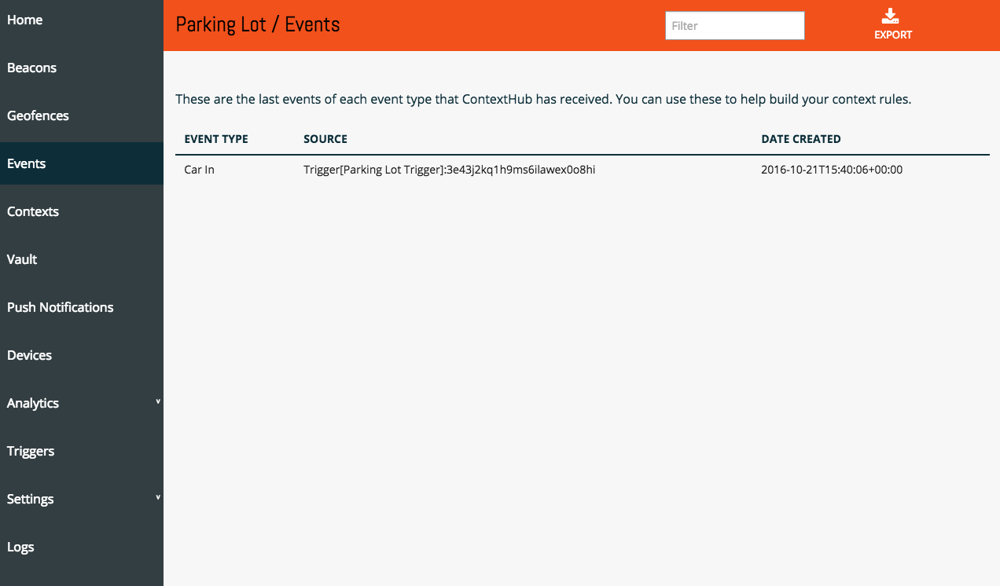
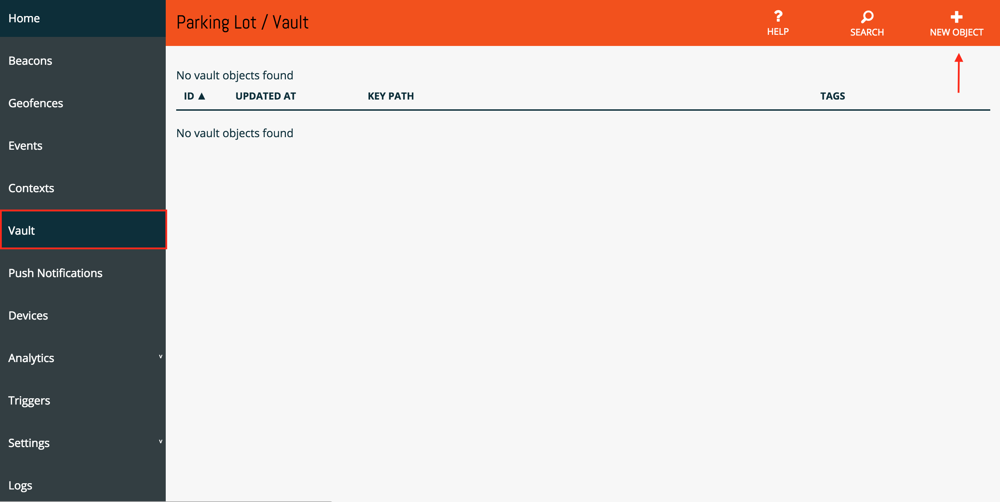
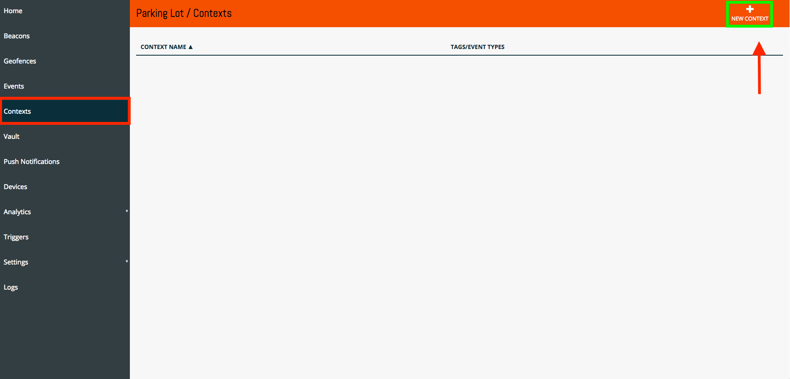
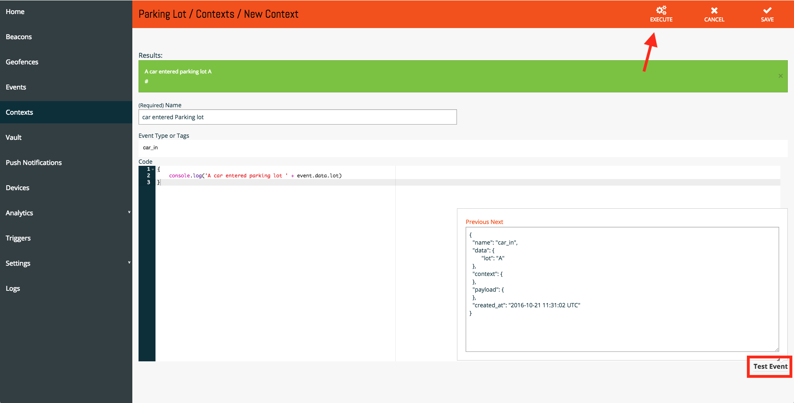
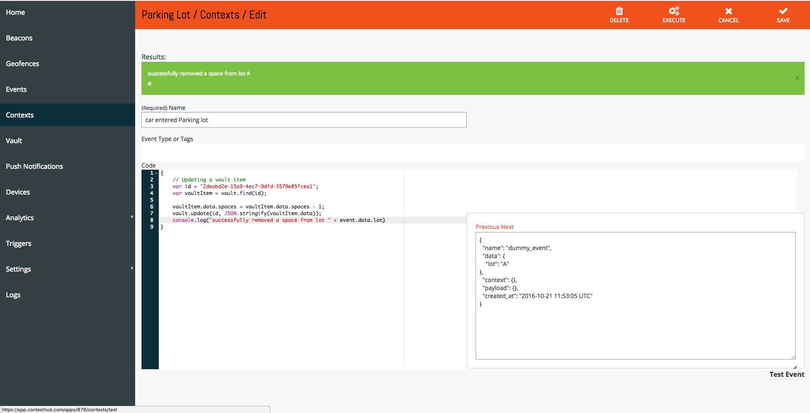

# Getting Started

For this example, we are going to pretend we've have built an application(mobile or web) that counts the number of spacing left in a parking lot. In this app, we have 2 buttons, one that says "Car In" and the other that says "Car out". Pretty simple right?

### Trigger
[Sign in](https://app.contexthub.com/users/sign_in) into ContextHub if you haven't already and create a new app and call it whatever you'd like. Next, we need to create a new trigger: 


Once you have created a trigger, you will be provided a URL that will look like this:
```
https://app.contexthub.com/api/triggers/<Trigger-ID>/YOUR_EVENT_NAME
```

### Events
Now we simply just have to change the event name at the end of the URL in order to create an event. So in our app, when the user presses the "Car In" button, we will send a `Post` request with a body to the following endpoint:

```
// url
https://app.contexthub.com/api/triggers/<Trigger-ID>/car_in

// body
{
	"lot" : "A"
}
```

Now if we move over to our `Events` tab on the left sidebar, we will see our called events.



Next, let's do the same thing for our `car_out` event:

```
// url
https://app.contexthub.com/api/triggers/<Trigger-ID>/car_out

// body
{
	"lot" : "A"
}
```

So ok, we are now able to fire off events... Now what? What if we have multiple parking lots and we need to track how many open spaces we have in each of those parking lots. How are we going to do that?

### Vault

Let's move over to our vault tab and create a new object, that will allow us to maintain state.



Next, you will be presented with a text editor let's go ahead and put the following JSON code inside:

```json
{
    "lot": "A",
    "spaces": 100
}
```

So awesome, we have events... we have an object[in our vault], how do we connect the two?


### Contexts

A Context allow's us to connect our events to the objects in our vault. Let's move over to our Contexts tab and create a new Context.



And for a basic example let's just `console.log` a simple message, paste the following inside of the Context text editor:

```javascript
{
    console.log('A car entered parking lot ' + event.data.lot)
}
```

And let's trigger this event from within our Context Editor, Select the `Test Event` at the bottom right corner of your screen and add some information to our nested `data` object. Finally, Press `Execute` at the top right of your page:



Alright, we're almost there! Lastly, we just have to reference the object in our vault from inside of our `Context` and subtract one from it's `spaces` property. If we checkout the documentation for a vault object, we'll see that the [following code](https://chaione.github.io/docs/contextualengine/#vault-update) would allow us to retrieve and update our object inside of our Context.



Here's the snippet of code:

```javascript
{
    // Updating a vault item
    var id = "2deabd2e-15a9-4ec7-9dfd-3579e85fcea1";
    var vaultItem = vault.find(id);
    
    vaultItem.data.spaces = vaultItem.data.spaces - 1;
    vault.update(id, JSON.stringify(vaultItem.data));
    console.log("successfully removed a space from lot " + event.data.lot)
}
```
Of course we hard-coded the `ObjectId`, the following snippet of code will show how to query items in your vault using [keypath](https://chaione.github.io/docs/contextualengine/#vault-keypath):

```javascript
{
    var parking_lots = vault.key_path("lot", event.data.lot);
    if (parking_lots.length > 0) {
        var p_lot = parking_lots[0]
        p_lot.data.spaces = p_lot.data.spaces - 1;
        console.log("A car came into parking lot " + event.data.lot + ", " + p_lot.data.spaces + " spaces remaining!")
        vault.update(p_lot.vault_info.id,JSON.stringify(p_lot.data));
    }
}
```

So there it is, we have successfully updated an object in our vault by trigger simply calling an event off our endpoint. I'll leave it to you to implement the `car_out` Context rule.

### Using http to trigger actions/update data

The final task we are going to walk through is using http to trigger actions / update data in external systems. To demonstrate this, we'll add a Contextual Rule that will run every minute and report the status of our parking lots to another system.

Let's start by adding another Contextual rule. Let's call it `Parking Lot Status` and enter `tick` in the Event Type to ensure the system runs it every minute (see the details for Tick [here](https://chaione.github.io/docs/contextualengine/#event-tick)). Then, enter the following snippet of code in the body of the rule:

```javascript
{
	var parking_lots = vault.search("lot");
	for (i = 0; i < parking_lots.length; i++) {
   	    var p_lot = parking_lots[i]
		//
		// Uncomment the next line to log what you're sending out to the console
		// console.log("- Parking lot " + p_lot.data.lot + " has " + p_lot.data.spaces + " spaces available")
		//
		// Now send this data to another system using POST
		http.post('http://requestb.in/wm603ywm', JSON.stringify(p_lot.data), JSON.stringify({"Content-Type":"application/json"}))
		//
		// Or we could send a GET request with parameters instead as in /wm603ywm?lot=A&spots_available=99
		http.get('http://requestb.in/wm603ywm', JSON.stringify(p_lot.data), JSON.stringify({"Content-Type":"application/json"}))
	}
}
```

You can read more details about using [http](https://chaione.github.io/docs/contextualengine/#http) in the documentation.

If you need any help, please do not hesitate to swing by the ChaiOne table or tweet [@initFabian](https://twitter.com/initFabian). 

We're very excited to see you all will build with ContextHub!
